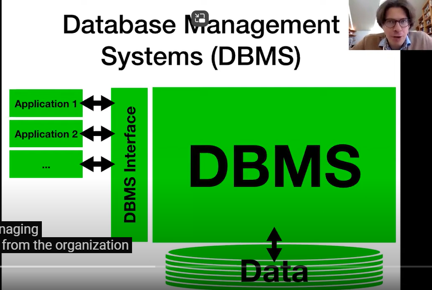
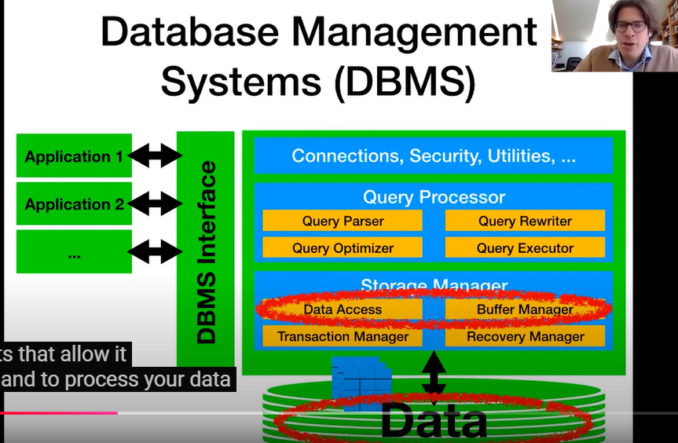
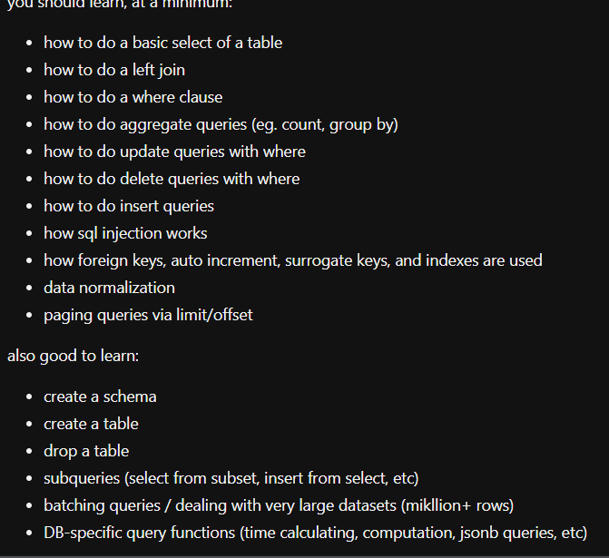

### Structured query language

http://www.databaselecture.com/

you should learn, at a minimum:

how to do a basic select of a table

how to do a left join

how to do a where clause

how to do aggregate queries (eg. count, group by)

how to do update queries with where

how to do delete queries with where

how to do insert queries

how sql injection works

how foreign keys, auto increment, surrogate keys, and indexes are used

data normalization

paging queries via limit/offset

also good to learn:

create a schema

create a table

drop a table

subqueries (select from subset, insert from select, etc)

batching queries / dealing with very large datasets (mikllion+ rows)

DB-specific query functions (time calculating, computation, jsonb queries, etc
